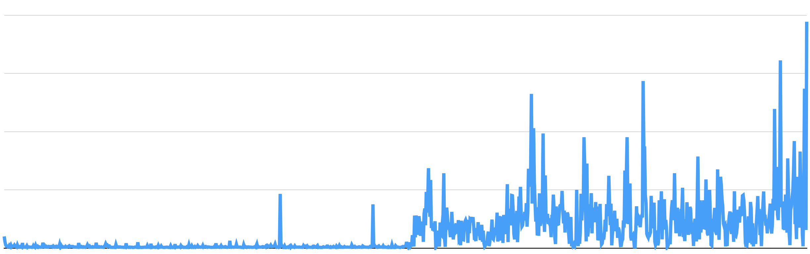

# download and parser

## English:

### Problem

Open Street Maps have maps with a large volume of data, the global map has something around 7.9 trillion points, making 
data processing time-consuming, raising the cost of maintaining the project.

The data is archived in relational format, where the first part of the file contains all the nodes and the second part 
of the file contains all the ways with the IDs of the nodes contained in the first part of the file.

When trying to insert all ~7.9 trillion nodes into the database, the insertion time goes up a lot as the database fills 
up.



```
|                                                            |                                                        |
|           Insertion time for a block of 100 nodes          |        Insertion time for a block of 100 nodes         |
|               Total nodes in the collection: 0             |     Total nodes in the collection: 1.000.000.000       |
|                                                            |                                                        |
+------------------------------------------------------------+--------------------------------------------------------+
```


To understand the problem, think of linear IDs, from 1 to 7.9 trillion.

In the test, entering ID 1 took µS, but as the database was filled, the insertion time reached ms.

Searching for an ID in the database faces the same problem, the first ID entered, in a search type, findById(1), returns 
the information in µS, while the search for the last inserted ID, findById(1,000,000,000), returns the value in ms.

This makes data processing very slow.

### Solution

Create a file for binary search, where all nodes are archived in binary.

The data is `ID+Longitude+Latitude` or `[8]bytes+[4]bytes+[4]bytes`.

The data is converted to binary before being saved, using the golang binary package, as the benchmark test showed the 
following performances:

| total process | Memory Allocs     | Type of golang data                          |
|---------------|-------------------|----------------------------------------------|
|  3.830812750s | 1511656176 Allocs | []byte using binary.LittleEndian.PutUint64() |
| 13.403035416s | 2413071824 Allocs | map[id][2]float64{longitude, latitude}       |
| 23.104297458s | 4426114960 Allocs | map[id][]float64{longitude, latitude}        |

However, a simple binary search with 7.9 trillion IDs would still take longer than necessary, so at the end of the file, 
samples of IDs are saved for a second binary search in memory, where the search returns two addresses, the left border 
and right border of where the searched ID is in the binary file, so the search is always limited to a fixed-size block, 
defined at the creation of the binary file.

```go
// ...                --+
// ...                  |
// ...                  +- header, configuration
// ...                  |
// ...                --+
// ID:0001            --+
// ID:0002              |
// ...                  |
// ...                  |
// ID:1024              +- primary binary search, on disk
// ID:1025              |
// ...                  |
// ...                  |
// ID:x               --+
// ID:0001:Addr:00040 --+
// ID:1025:Addr:        |
// ID:3073:Addr:        +- secondary binary search, in memory
// ID:4097:Addr:        |
// ID:xxxx:Addr:xxxxx --+
```

### Result

Total processing time has been reduced by more than 10x

### Example

This example downloads a map file and inserts it into the `MongoDB` database

### Requerimentos:

[MongoDB](https://www.mongodb.com/docs/manual/installation/) installed on port 27016 with the `osm` bank free to use.

> There is an example of how to install `MongoDB`, with the help of `docker`

### How to use this example:

```shell
  make build
```

## Português:

### Problema

O Open Street Maps têm mapas com um volume grande de dados, o mapa global tem algo em torno de 7.9 trilhões de pontos,
tornando o processamento de dados muito demorado, elevando o custo de manutenção do projeto.

Os dados são arquivados em formato relacional, onde a primeira parte do arquivo contém todos os nodes e a segunda parte 
do arquivo contém todos os ways com os IDs dos nodes contidos na primeira parte do arquivo.

Quando se tenta inserir todos os ~7.9 trilhões de nodes no banco de dados, o tempo de inserção sobe muito a medida que
banco de dados é preenchido.


```shell
|                                                            |                                                        |
|        Tempo de inserção de para bloco de 100 nodes        |      Tempo de inserção de para bloco de 100 nodes      |
|                 Total de nodes na coleção: 0               |        Total de nodes na coleção: 1.000.000.000        |
|                                                            |                                                        |
+------------------------------------------------------------+--------------------------------------------------------+
```

Para entender o problema, pense em IDs linear, de 1 a 7.9 trilhões. 
No teste, inserir o ID 1 levou µS, mas, a medida que o banco de dados foi preenchido, o tempo de inserção chegou a ms.
Procurar por um ID no banco de dados enfrenta o mesmo problema, o primeiro ID inserido em uma busca tipo, findById(1),
retorna a informação em µS, já a busca pelo último ID inserido, findById(1.000.000.000), retorna o valor em ms.
Isto deixa o processamento de dados muito lento.

### Solução

Criar um arquivo para busca binária, onde todos os nodes são arquivados em binário.

O dado é formado por `ID+Longitude+Latitude` ou `[8]bytes+[4]bytes+[4]bytes`.

Os dados são convertidos em binário antes de serem salvos, usando o pacote binário do golang, pois, o teste de benchmark
mostraram os seguintes desempenhos:

| total process | Memory Allocs     | Type of golang data                          |
|---------------|-------------------|----------------------------------------------|
|  3.830812750s | 1511656176 Allocs | []byte using binary.LittleEndian.PutUint64() |
| 13.403035416s | 2413071824 Allocs | map[id][2]float64{longitude, latitude}       |
| 23.104297458s | 4426114960 Allocs | map[id][]float64{longitude, latitude}        |

Porém, uma busca binária simples, com 7.9 trilhões de IDs ainda seria mais demorada do que o necessário, por isto, ao
final do arquivo, são salvos amostras de IDs para uma segunda busca binária em memória, onde a busca retorna dois 
endereços, a borda esquerda e a borda direita de onde o ID procurado se encontra no arquivo binário, assim, a busca é
sempre limitada a um bloco de tamanho fixo, definido na criação do arquivo binário.

```go
// ...                --+
// ...                  |
// ...                  +- header, configuração
// ...                  |
// ...                --+
// ID:0001            --+
// ID:0002              |
// ...                  |
// ...                  |
// ID:1024              +- busca binária primária, em disco
// ID:1025              |
// ...                  |
// ...                  |
// ID:x               --+
// ID:0001:Addr:00040 --+
// ID:1025:Addr:        |
// ID:3073:Addr:        +- busca binária secundária, em memória
// ID:4097:Addr:        |
// ID:xxxx:Addr:xxxxx --+
```

### Resultado

O tempo total de processamento foi reduzido em mais de 10x

### Exemplo

Este exemplo baixa um arquivo de mapas e insere no banco de dados `MongoDB`

### Requerimentos:

[MongoDB](https://www.mongodb.com/docs/manual/installation/) instalado na porta 27016 com o banco `osm` livre para uso.

> Há um exemplo de como instalar o `MongoDB` de forma simples, com a ajuda do `docker`

### Como usar este exemplo:

```shell
  make build
```
