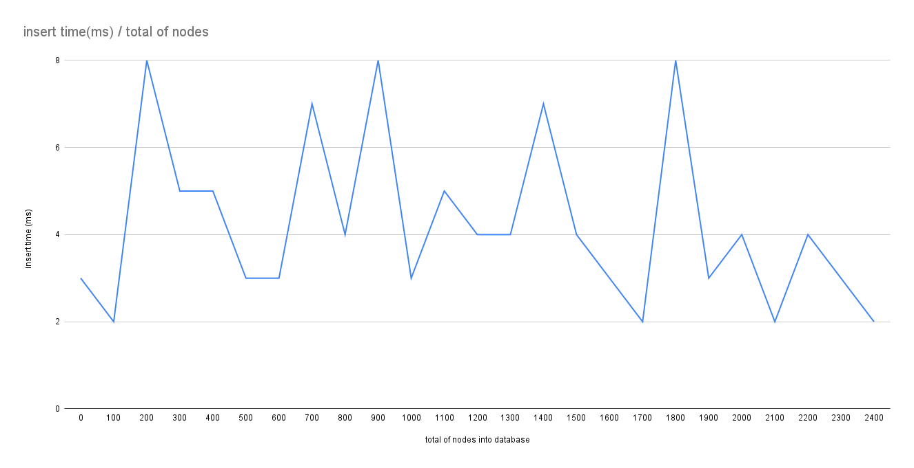
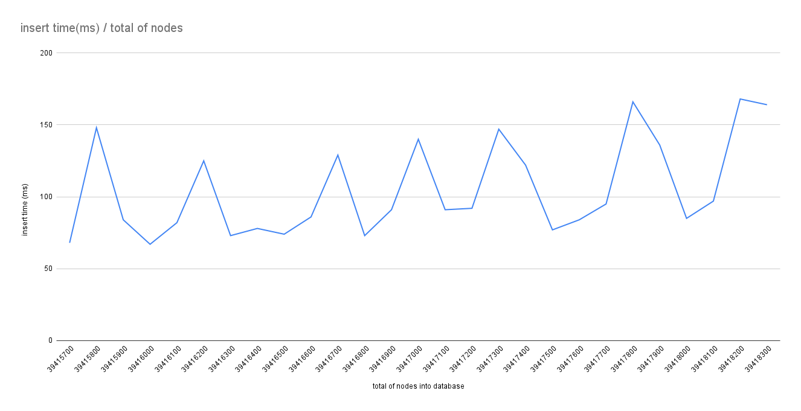

# download and parser binary file only

## English:

### Problem

Open Street Maps have maps with a large volume of data, the global map has something around 7.9 trillion points, making 
data processing time-consuming, raising the cost of maintaining the project.

The data is archived in relational format, where the first part of the file contains all the nodes and the second part 
of the file contains all the ways with the IDs of the nodes contained in the first part of the file.

When trying to insert all ~7.9 trillion nodes into the database, the insertion time goes up a lot as the database fills 
up.

The graph below shows the amount of nodes contained in the collection, and the insertion time as more nodes are inserted 
into the collection for the first 2.400 nodes.



However, as more data is entered, the insertion time goes up, making it very difficult to enter 7.9 trillion nodes.



Some test points:

* When the MongoDB collection was clean, the code could insert an average of 180,000 nodes in 2s;
* An ID search in MongoDB showed an efficiency of 1.099.788 ns/op for ID=1;
* After just over 39 million nodes were inserted, the code lost efficiency and started to insert approximately 80.000 nodes in 2s;
* An ID search in MongoDB showed an efficiency of 1.088.285 ns/op for ID=39 million;

### Solution

Create a file for binary search, where all nodes are archived in binary.

The data is `ID+Longitude+Latitude` or `[8]bytes+[4]bytes+[4]bytes`.

The data is converted to binary before being saved, using the golang binary package, as the benchmark test showed the 
following performances:

| total process | Memory Allocs     | Type of golang data                          |
|---------------|-------------------|----------------------------------------------|
|  3.830812750s | 1511656176 Allocs | []byte using binary.LittleEndian.PutUint64() |
| 13.403035416s | 2413071824 Allocs | map[id][2]float64{longitude, latitude}       |
| 23.104297458s | 4426114960 Allocs | map[id][]float64{longitude, latitude}        |

However, a simple binary search with 7.9 trillion IDs would still take longer than necessary, so at the end of the file, 
samples of IDs are saved for a second binary search in memory, where the search returns two addresses, the left border 
and right border of where the searched ID is in the binary file, so the search is always limited to a fixed-size block, 
defined at the creation of the binary file.

```go
// ...                --+
// ...                  |
// ...                  +- header, configuration
// ...                  |
// ...                --+
// ID:0001            --+
// ID:0002              |
// ...                  |
// ...                  |
// ID:1024              +- primary binary search, on disk
// ID:1025              |
// ...                  |
// ...                  |
// ID:x               --+
// ID:0001:Addr:00040 --+
// ID:1025:Addr:        |
// ID:3073:Addr:        +- secondary binary search, in memory
// ID:4097:Addr:        |
// ID:xxxx:Addr:xxxxx --+
```

### Result

Once populated with over 7.9 trillion nodes, the binary search had an efficiency of 9.390 ns/op (~100x more efficient) **

> ** 2048 randomly chosen IDs were used, and the sample block set to 1024 items per block.

### Example

This example downloads a map file and inserts it into the `MongoDB` database.

### Requerimentos:

[MongoDB](https://www.mongodb.com/docs/manual/installation/) installed on port 27016 with the `osm` bank free to use.

> There is an example of how to install `MongoDB`, with the help of `docker`

### How to use this example:

```shell
  make build
```

## Português:

### Problema

O Open Street Maps têm mapas com um volume grande de dados, o mapa global tem algo em torno de 7.9 trilhões de pontos,
tornando o processamento de dados muito demorado, elevando o custo de manutenção do projeto.

Os dados são arquivados em formato relacional, onde a primeira parte do arquivo contém todos os nodes e a segunda parte 
do arquivo contém todos os ways com os IDs dos nodes contidos na primeira parte do arquivo.

Quando se tenta inserir todos os ~7.9 trilhões de nodes no banco de dados, o tempo de inserção sobe muito a medida que
o banco de dados é preenchido.

O gráfico abaixo mostra a quantidade de nodes contida na coleção, e o tempo de inserção a medida que mais nodes são 
inseridos na coleção para os primeiros 2.400 nodes


Porém, a medida que mais dados são inseridos, o tempo de inserção sobe, dificultando muito a inserção de 7.9 trilhões
de nodes.


Alguns pontos do teste:

  * Quando a coleção do MongoDB estava limpa, o código conseguia inserir uma média de 180.000 nodes em 2s;
  * Uma busca por ID no MongoDB demostrou uma eficiência de 1.099.788 ns/op para ID=1;
  * Depois de pouco mais de 39 milhões nodes inseridos, o código perdeu eficiência e passou a inserir aproximadamente 80.000 nodes em 2s;
  * Uma busca por ID no MongoDB demostrou uma eficiência de 1.088.285 ns/op para ID=39 milhões;

### Solução

Criar um arquivo para busca binária, onde todos os nodes são arquivados em binário.

O dado é formado por `ID+Longitude+Latitude` ou `[8]bytes+[4]bytes+[4]bytes`.

Os dados são convertidos em binário antes de serem salvos, usando o pacote binário do golang, pois, o teste de benchmark
mostraram os seguintes desempenhos:

| total process | Memory Allocs     | Type of golang data                          |
|---------------|-------------------|----------------------------------------------|
|  3.830812750s | 1511656176 Allocs | []byte using binary.LittleEndian.PutUint64() |
| 13.403035416s | 2413071824 Allocs | map[id][2]float64{longitude, latitude}       |
| 23.104297458s | 4426114960 Allocs | map[id][]float64{longitude, latitude}        |

Porém, uma busca binária simples, com 7.9 trilhões de IDs ainda seria mais demorada do que o necessário, por isto, ao
final do arquivo, são salvos amostras de IDs para uma segunda busca binária em memória, onde a busca retorna dois 
endereços, a borda esquerda e a borda direita de onde o ID procurado se encontra no arquivo binário, assim, a busca é
sempre limitada a um bloco de tamanho fixo, definido na criação do arquivo binário.

```go
// ...                --+
// ...                  |
// ...                  +- header, configuração
// ...                  |
// ...                --+
// ID:0001            --+
// ID:0002              |
// ...                  |
// ...                  |
// ID:1024              +- busca binária primária, em disco
// ID:1025              |
// ...                  |
// ...                  |
// ID:x               --+
// ID:0001:Addr:00040 --+
// ID:1025:Addr:        |
// ID:3073:Addr:        +- busca binária secundária, em memória
// ID:4097:Addr:        |
// ID:xxxx:Addr:xxxxx --+
```

### Resultado

Depois de preenchido, com mais de 7.9 trilhões de nodes, a busca binária teve uma eficiência de 9.390 ns/op (~100x mais eficiente) **

> ** Foram usados 2048 IDs escolhidos aleatoriamente e o bloco de amostras configurado para 1024 itens por bloco.

### Exemplo

Este exemplo baixa um arquivo de mapas e insere no banco de dados `MongoDB`

### Requerimentos:

[MongoDB](https://www.mongodb.com/docs/manual/installation/) instalado na porta 27016 com o banco `osm` livre para uso.

> Há um exemplo de como instalar o `MongoDB` de forma simples, com a ajuda do `docker`

### Como usar este exemplo:

```shell
  make build
```
